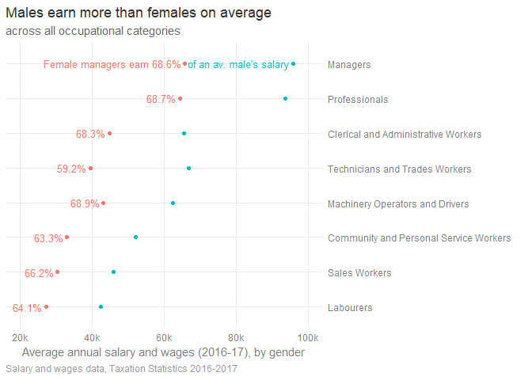
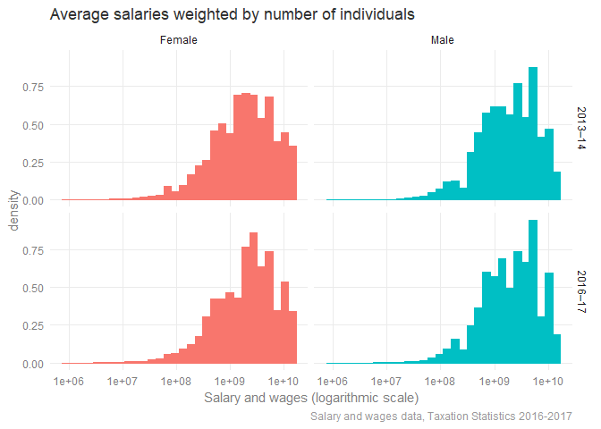
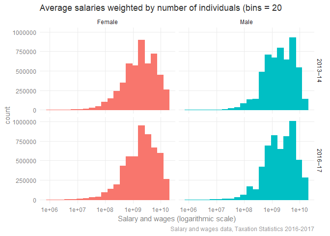
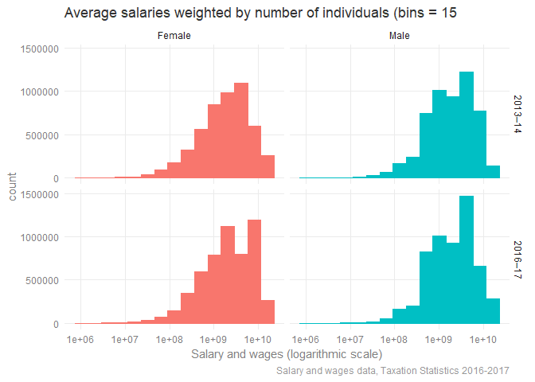
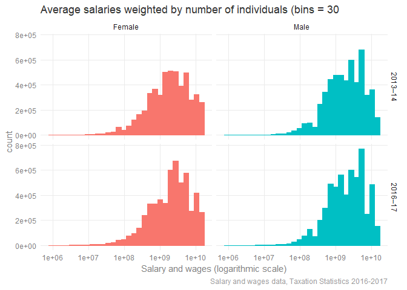
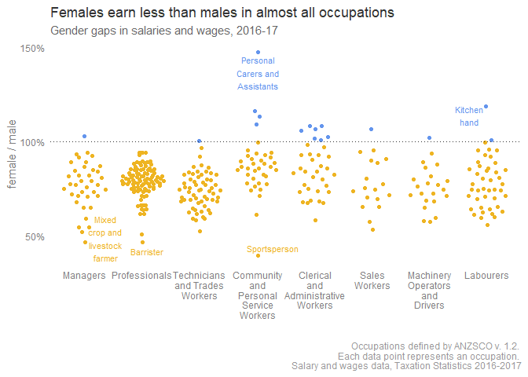
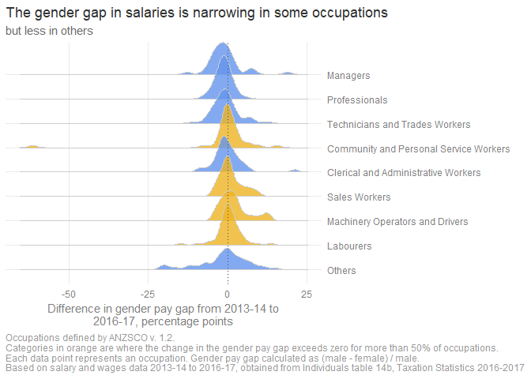

```r
library(readxl)
library(forcats)
library(ggrepel)

library(here)
library(ggbeeswarm)
library(janitor)
library(dplyr)
library(stringr)
library(tidyr)
library(ggplot2)

read_excel(here("data", 
                "ts17individual14occupationsextaxableincomerangeyear.xlsx"), 
           sheet = "Individual Table 14B", 
           skip = 3, 
           na = "na") %>% 
  clean_names() %>% 
  filter(sex != "i. all ranges") %>% 
  # filter out occupation blank
  filter(str_sub(occupation_unit_group1, 1, 1) != "0") -> tbl14b


tibble(groups = 1:9, 
       names = c("Managers", 
                 "Professionals", 
                 "Technicians and Trades Workers",
                 "Community and Personal Service Workers", 
                 "Clerical and Administrative Workers", 
                 "Sales Workers",
                 "Machinery Operators and Drivers", 
                 "Labourers",
                 "Others")) -> anzsco_main_classes
 
theme_minimal_modified <- function() { 
  theme_minimal() + 
    theme(axis.title = element_text(color = "grey50"), 
          panel.grid.minor = element_blank(), 
          axis.text = element_text(color = "grey50"), 
          plot.caption = element_text(color = "grey60"), 
          plot.subtitle = element_text(color = "grey40"), 
          plot.title = element_text(color = "grey20"))
}
```


```r
tbl14b %>% 
  select(-taxable_income_ranges_tax_brackets) %>% 
  mutate(occupation = str_sub(occupation_unit_group1, 6), 
         main_class = as.numeric(str_sub(occupation_unit_group1, 1, 1))) %>% 
  group_by(year = income_year2, 
           occupation, 
           sex) %>% 
  summarise(av_salary = sum(salary_or_wages)/sum(number_of_individuals_no), 
            total_salary = sum(salary_or_wages),
            n_individuals = sum(number_of_individuals_no), 
            main_class = mean(main_class)) %>% 
  ungroup() %>% 
  # some sex-occupation combinations can have very few individuals within 
  # to ensure the results aren't influenced by occupations with small numbers of individuals, 
  # remove observations where the number of individuals is less than the 5% quantile for each year (around 62) 
  group_by(year) %>% 
  filter(n_individuals > quantile(n_individuals, .05)) -> tbl14b_by_occupation
```


```r
# now check for occupations where there's only 1 gender, then anti-join to remove 
tbl14b_by_occupation %>% 
  count(occupation, year) %>% 
  filter(n == 1) -> only_one

tbl14b_by_occupation %>% 
  anti_join(only_one, by = c("occupation", "year")) -> tbl14b_by_occupation

tbl14b_by_occupation %>% 
  group_by(main_class, year, sex) %>% 
  summarise(total_salary = sum(total_salary), 
            total_individuals = sum(n_individuals)) %>% 
  ungroup() %>% 
  mutate(av_salary = total_salary / total_individuals) %>% 
  left_join(anzsco_main_classes, c(main_class = "groups")) %>% 
  select(year, sex, av_salary, names)  -> tbl14b_by_main

tbl14b_by_main %>% 
  spread(sex, av_salary) %>% 
  mutate(Female = scales::percent(Female / Male),
         Male = NA) %>% 
  gather(sex, pct, Female, Male) %>% 
  mutate(pct = ifelse(names == "Managers", 
                         ifelse(sex == "Female", 
                                glue::glue("Female managers earn {pct}"), 
                                "of an av. male's salary"), 
                         pct))-> tbl14b_pcts


tbl14b_by_main %>% 
  filter(year == "2016–17", names != "Others") %>% 
  left_join(tbl14b_pcts, by = c("year", "names", "sex")) %>%
  ggplot(aes(x = av_salary, y = fct_reorder(names, av_salary), color = sex))  + 
    geom_point() + 
    geom_text(aes(label = pct), 
              hjust = 1, 
              vjust = .5,
              nudge_x = -1000, 
              size = 3.5) +
    scale_x_continuous(limits = c(20000, 100000),
                       labels = scales::number_format(accuracy = 1,
                                                      scale = 1/1000,
                                                      suffix = "k")) + 
    scale_y_discrete(position = "right") +
    theme_minimal_modified() + 
    guides(color = FALSE) + 
    theme(legend.position = "bottom") + 
    labs(x = "Average annual salary and wages (2016-17), by gender",
         y = "", 
         title = "Males earn more than females on average", 
         subtitle = "across all occupational categories", 
         caption = "Salary and wages data, Taxation Statistics 2016-2017") + 
    theme(plot.caption = element_text(hjust = 0))
```

```
## Warning: Removed 7 rows containing missing values (geom_text).
```

<!-- -->

```r
ggsave(here("output", "average_salaries_gender_category.svg"))
```

```
## Saving 7 x 5 in image
```

```
## Warning: Removed 7 rows containing missing values (geom_text).
```


```r
experiment_bins <- function(bins = NULL) {tbl14b_by_occupation %>% 
  filter(year %in% c("2013–14", "2016–17")) %>% 
  ggplot(aes(x = total_salary, 
             fill = sex, 
             color = sex,
             weights = n_individuals)) + 
    geom_histogram(bins = bins) + 
    scale_x_log10() + 
    guides(fill = FALSE, color = FALSE) + 
    theme_minimal_modified() + 
    facet_grid(rows = vars(year), cols = vars(sex)) + 
    labs(title = glue::glue("Average salaries weighted by number of individuals (bins = {bins}"), 
         x = "Salary and wages (logarithmic scale)", 
         caption = "Salary and wages data, Taxation Statistics 2016-2017")
}
experiment_bins(bins = 30)
```

<!-- -->

```r
experiment_bins(bins = 20)
```

<!-- -->

```r
experiment_bins(bins = 15)
```

<!-- -->


```r
tbl14b_by_occupation %>% 
  filter(year %in% c("2013–14", "2016–17")) %>% 
  ggplot(aes(x = total_salary, 
             fill = sex, 
             color = sex,
             weights = n_individuals,
             y = ..density..)) + 
    geom_histogram(bins = 30) + 
    scale_x_log10() + 
    guides(fill = FALSE, color = FALSE) + 
    theme_minimal_modified() + 
    facet_grid(rows = vars(year), cols = vars(sex)) + 
    labs(title = "Average salaries weighted by number of individuals", 
         x = "Salary and wages (logarithmic scale)", 
         caption = "Salary and wages data, Taxation Statistics 2016-2017")
```

<!-- -->

```r
ggsave(here("output", "salaries_distribution.svg"))
```

```
## Saving 7 x 5 in image
```


```r
tbl14b_by_occupation %>%
  filter(year %in% c("2013–14", "2016–17")) %>%
  filter(!str_detect(occupation, coll("not specified"))) %>%
  select(-total_salary, -n_individuals) %>%
  spread(sex, av_salary) %>%
  ungroup() %>%
  filter(occupation != "Other") %>%
  mutate(gap = Male - Female,
         female_pct_male = Female / Male,
         gap_pct = (Male - Female)/Male) %>%
  left_join(anzsco_main_classes, by = c(main_class = "groups")) %>%
  filter(!occupation %in% c("Occupation blank",
                            "Miscellaneous type not specified",
                            "Occupation not matched")) -> subset_14b
```

```r
subset_14b %>% 
  select(year, female_pct_male, occupation, names) %>%
  filter(year == "2016–17", names != "Others") %>% 
#  spread(year, female_pct_male) %>% 
#  mutate(pp_change = `2016–17` - `2013–14`) %>% 
  mutate(names = factor(names, levels = anzsco_main_classes$names), 
         occupation_lab = ifelse(female_pct_male > 1.18 | female_pct_male < .5, occupation, ""), 
         gap_color = female_pct_male > 1) %>% 
  ggplot(aes(x = names, y = female_pct_male, color = gap_color)) + 
  geom_quasirandom() + 
  geom_text_repel(aes(label = str_wrap(occupation_lab, 10)), size = 3) + 
  guides(color = FALSE) + 
  # coord_flip() + 
  scale_y_continuous(labels = function(x) scales::percent(x = x, accuracy = 2), 
                     breaks = c(.5, 1, 1.5)) + 
  scale_color_manual(values = c("goldenrod2", "cornflowerblue")) + 
  scale_x_discrete(labels = function(x) str_wrap(x, width = 10)) + 
  geom_hline(yintercept = 1, linetype = "dotted", color = "grey20") + 
  theme_minimal_modified() + 
  theme(panel.grid = element_blank()) + 
  labs(title = "Females earn less than males in almost all occupations", 
       x = "", 
       y = "female / male",
       subtitle = "Gender gaps in salaries and wages, 2016-17", 
       caption = "Occupations defined by ANZSCO v. 1.2. \nEach data point represents an occupation. \n Salary and wages data, Taxation Statistics 2016-2017") 
```

<!-- -->

```r
ggsave(here("output", "female_over_male.svg"))
```

```
## Saving 7 x 5 in image
```


```r
library(ggbeeswarm)
library(forcats)
library(ggridges)
```

```
## 
## Attaching package: 'ggridges'
```

```
## The following object is masked from 'package:ggplot2':
## 
##     scale_discrete_manual
```

```r
library(hrbrthemes)

subset_14b %>%
  select(year, gap_pct, occupation, names) %>%
  spread(year, gap_pct) %>%
  mutate(pp_change = `2016–17` - `2013–14`) %>% 
  mutate(names = factor(names, levels = anzsco_main_classes$names)) %>%
  group_by(names) %>% 
  mutate(color_lab = sum(pp_change  > 0, na.rm = TRUE)/ n() > .5) %>%
  ggplot(aes(y = fct_rev(names), x = pp_change * 100, fill = color_lab, color = color_lab)) +
  geom_density_ridges2(alpha = .8, color = "grey80") + 
  scale_fill_manual(values = c("cornflowerblue", "goldenrod2")) + 
  guides(color = FALSE, fill = FALSE) + 
  theme_minimal_modified() + 
  scale_y_discrete(position = "right") + 
  geom_vline(xintercept = 0, color = "grey30", linetype = "dotted") + 
  labs(y = "", 
       x = str_wrap("Difference in gender pay gap from 2013-14 to 2016-17, percentage points", 50),
       title = "The gender gap in salaries is narrowing in some occupations",
       subtitle = "but less in others",
       caption = "Occupations defined by ANZSCO v. 1.2. \nCategories in orange are where the change in the gender pay gap exceeds zero for more than 50% of occupations. \nEach data point represents an occupation. Gender pay gap calculated as (male - female) / male. \nBased on salary and wages data 2013-14 to 2016-17, obtained from Individuals table 14b, Taxation Statistics 2016-2017") + 
  theme(plot.caption = element_text(hjust = 0))
```

```
## Picking joint bandwidth of 1.32
```

```
## Warning: Removed 7 rows containing non-finite values (stat_density_ridges).
```

<!-- -->

```r
ggsave(here("output", "narrowing_gender_gap.svg"))
```

```
## Saving 7 x 5 in image
```

```
## Picking joint bandwidth of 1.32
```

```
## Warning: Removed 7 rows containing non-finite values (stat_density_ridges).
```


